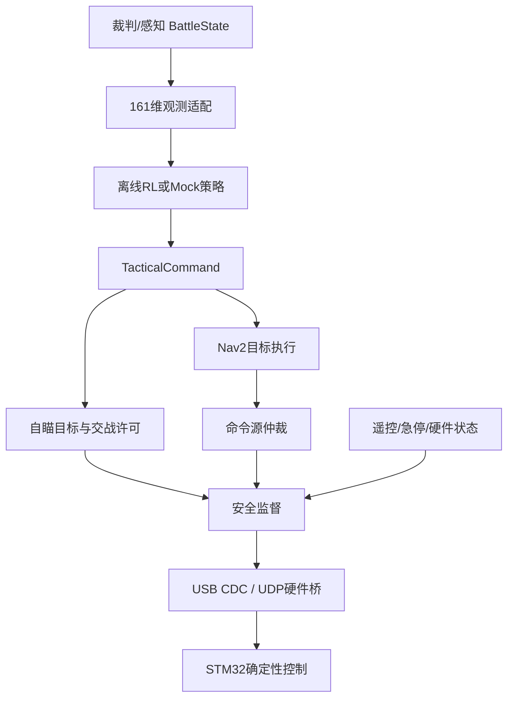
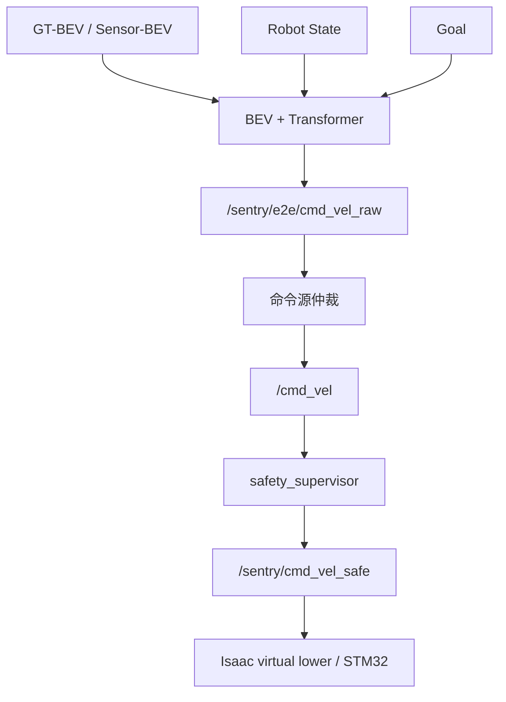

# 哨兵全流程架构

> 本文件是目标架构与接口边界，不代表所有运行阶段已经通过验收。当前状态以
> [PROJECT_STATE.md](PROJECT_STATE.md)、[TOPIC_CONTRACT.md](docs/TOPIC_CONTRACT.md)
> 和 [TEST_GATES.md](docs/development/TEST_GATES.md) 为准。

## 1. 分层边界

| 层 | 频率 | 输入 | 输出 | 不负责 |
|---|---:|---|---|---|
| 战术策略 | 1 Hz | 161 维战场观测 | 子目标、目标槽位、交战许可 | 电机、云台角速度、扣扳机时刻 |
| 端到端底盘策略 | 10–50 Hz | BEV、机器人状态、goal | `vx, vy, wz` | 舵轮解算、电流、云台、开火 |
| 任务调度 | 1–10 Hz | 裁判状态、目标、健康状态 | 模式、任务、Nav2 action | 直接闭环控制 |
| 导航/自瞄 | 20–200 Hz | 地图、点云、图像、战术命令 | 速度、瞄准量、发射请求 | 学习长期战术 |
| 安全监督 | 50–100 Hz | 所有命令、硬件状态 | 钳制后的唯一执行命令 | 提升策略收益 |
| 固件控制 | 500–1000 Hz | 速度/角度参考 | CAN/PWM/电机力矩 | 全局规划 |

## 2. ROS 2 数据流

### 2.1 战术路线



### 2.2 端到端底盘路线



`/sentry/cmd_vel_safe` 是底盘唯一允许执行的 ROS 速度话题。端到端推理节点、
Nav2、遥控和调试节点都不得绕过安全监督。

## 3. 三种模式

| 模式 | 时钟 | 里程计/传感器来源 | 执行端 |
|---|---|---|---|
| `sim` | `/clock` | Isaac Sim 或 mock | 仿真机器人 |
| `hil` | 系统时间 | 仿真感知 + 真实/台架控制器 | UDP/串口 |
| `real` | 系统时间 | MID360、相机、定位、裁判系统 | USB CDC/串口 |

模式只替换“端口”，不替换上层业务接口。

## 4. 训练与部署

### 4.1 离线战术阶段

`training/RMUC-OfflineRL` 从官方 SQLite 日志构建 161 维观测和 10 维战术动作：

- 2 维：约 5 秒后的导航子目标偏移；
- 1 维：是否允许交战；
- 7 维：六类敌方槽位加“无目标”。

它继续服务“去哪、打谁、是否允许交战”的战术决策，不与端到端底盘动作契约混用。

### 4.2 原 Isaac Lab 战术骨架

`training/isaac_lab` 保留 161D/10D 契约，供原战术路线在线训练/迁移。

### 4.3 端到端训练

`training/end_to_end` 独立维护以下契约：

```text
Observation:
BEV [C,H,W]
+
[vx, vy, wz, goal_dx, goal_dy]

Action:
normalized [vx, vy, wz]
```

默认 BEV v0 为 128×128、0.1 m/cell、6 channels：

```text
obstacle
free
unknown
enemy
self
goal
```

训练顺序：

```text
GT-BEV Teacher
→ Behavior Cloning / PPO
→ Sensor-BEV Student
→ Distillation
→ Noise / latency fine-tuning
→ ROS deployment / replay
→ HIL
→ real
```

训练内环直接使用 GPU tensor，不把成百上千个环境的每个 physics step 发送进 DDS。

策略输出只允许是机器人级速度 `[vx,vy,wz]`。实际舵轮 IK/FK、舵角、轮速和电机闭环由确定性控制层处理。

## 5. 安全约束

安全监督至少执行：

1. 急停锁存；
2. `real/hil` 模式硬件心跳超时即零力；
3. Nav2/遥控/端到端策略命令超时即速度归零；
4. 速度、角速度和加速度限幅；
5. 弹药耗尽、枪管热量余量不足、硬件离线时撤销 `weapons_free`；
6. 无目标时禁止交战；
7. 固件再次重复相同约束。

学习策略不能成为最后一道安全防线。

## 6. 坐标系

统一使用 REP-105 风格：

```text
map -> odom -> base_link -> lidar_link
                         -> camera_link
                         -> gimbal_yaw_link -> gimbal_pitch_link -> barrel_link
```

端到端学习接口固定：

```text
+X = forward
+Y = left
+Z = up
positive yaw = CCW around +Z
```

Isaac/CAD 资产轴向差异必须在 adapter 层统一转换，禁止在各学习/控制节点里分别添加魔法偏移。
